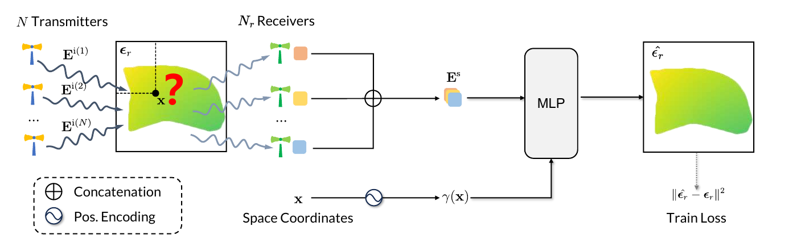

<div align="center">

# Electromagnetic Inverse Scattering from a Single Transmitter (CVPR 2026 Highlight)

**Yizhe Cheng, Chunxun Tian, Haoru Wang, Wentao Zhu, Xiaoxuan Ma, Yizhou Wang**

[🌐 Project Page](https://gomenei.github.io/SingleTX-EISP/) | [📄 Paper](https://arxiv.org/abs/2506.21349) | [▶️ Video](https://youtu.be/Rh1y83JXY-s)

</div>

This repository contains the PyTorch implementation of **Electromagnetic Inverse Scattering from a Single Transmitter**, with unified training and evaluation for MNIST, Circular-cylinder (CYLINDER), Institut Fresnel (IF), 3D MNIST, and 3D ShapeNet.

## TODO

- [x] Release unified training and evaluation code.
- [x] Provide configurations for the experiments presented in the paper.
- [x] Release the training datasets.
- [ ] Release data generation and preprocessing code.

## 1. Introduction

We propose a fully end-to-end, data-driven framework for electromagnetic inverse scattering. By learning data distribution priors, the model compensates for information scarcity in sparse-transmitter setups and predicts relative permittivity directly from scattered-field measurements and spatial coordinates.


The shared MLP takes the real and imaginary measurements, together with Fourier-encoded query coordinates, and predicts the permittivity at each pixel or voxel.



## 2. Preparation

### Environment setup

Python 3.10 or newer is required. For example:

```bash
conda create -n GenEISP python=3.11.10
conda activate GenEISP
pip install -r requirements.txt
```

### Dataset Setup

1. **Download the test datasets**  
   Please download the test datasets from [GoogleDrive](https://drive.google.com/file/d/1OQ8ttg6ALSo49xycsLx3tLgDvslgsyQn/view?usp=sharing).

2. **Extract and organize the data**  
   Place `test.zip` and all ten training parts (`train.zip.001`–`train.zip.010`) in `../downloads/`, then run:

   ```bash
   python prepare_data.py --download-dir ../downloads --output ../data
   ```

   The folder structure should look like this:
   ```text
   data/
   ├── train/
   │   ├── cylinder_mnist_inc16/
   │   ├── if_inc8/
   │   └── if_inc18/
   └── test/
       ├── cylinder/cylinder_test_inc16/
       ├── mnist/mnist_test_inc16/
       └── IF/
           ├── FDE/
           ├── FDI/
           └── FTD/
   ```

   Update the dataset paths in the configuration file if your filenames differ.

3. **Training data**  
   Download all training parts from [GoogleDrive](https://drive.google.com/drive/folders/1VLCnQW5yrQTktAMOQKwTBnVmMhupJy8x?usp=sharing). MNIST and CYLINDER use a combined training set; IF uses matching synthetic training data.

### Pre-trained Model Setup

1. **Download the pre-trained model**  
   Download the available model packages from [GoogleDrive](https://drive.google.com/drive/folders/1HwvEvqjJetX2mjDMkzSn7sKtP6ruLupA?usp=sharing).

2. **Organize the model weights**  
   Extract the model packages into `../` so checkpoints are placed in `../runs/`:

   ```bash
   python -m zipfile -e ../downloads/models_2d.zip ..
   python -m zipfile -e ../downloads/models_3d.zip ..
   ```

   These checkpoints are for evaluation. For training initialization, use `--weights`, not `--resume`.

## 3. Evaluation

### ⚙️ 3.1. Configuration File (`config.yaml`)

Configuration files follow the naming convention:  
**`[dataset_name]_noise[level]_N[transmitter_number].yaml`**.

| Example File | Meaning |
|---|---|
| `cylinder_noise05_N16.yaml` | Cylinder, 5% noise, 16 transmitters |
| `mnist_noise30_N16.yaml` | MNIST, 30% noise, 16 transmitters |
| `mnist_noise05_N1.yaml` | MNIST, 5% noise, 1 transmitter |
| `IF_FDE_noise00_N8.yaml` | FoamDielExt, no added noise, 8 transmitters |
| `IF_FDI_noise00_N8.yaml` | FoamDielInt, no added noise, 8 transmitters |
| `IF_FTD_noise00_N18.yaml` | FoamTwinDiel, no added noise, 18 transmitters |
| `3Dmnist_noise05_N6.yaml` | 3D MNIST, 5% noise, 6 transmitters |
| `3DShapeNet_noise05_N1.yaml` | 3D ShapeNet, 5% noise, 1 transmitter |
| `mnist_noise15_N16.yaml` | Noise-level ablation, 15% noise |
| `mnist_noise30_N16_data25.yaml` | Training-data ablation, 25% training data |

Each configuration contains `train` and `test` sections. Set `train.channel: 0` for one transmitter or `train.channel: -1` for all transmitters.

### ▶️ 3.2. Run Evaluation

- **For 2D datasets (cylinder, mnist, IF):**

```bash
python test.py --config config/cylinder_noise30_N16.yaml
python test.py --config config/mnist_noise30_N16.yaml
python test.py --config config/IF_FDE_noise00_N8.yaml
```

- **For 3D datasets (3D MNIST, 3D ShapeNet):**

```bash
python test.py --config config/3Dmnist_noise05_N1.yaml
python test.py --config config/3DShapeNet_noise05_N1.yaml
```

## 4. Training

Update `train.train_data`, `train.test_data`, and `train.output` in the selected configuration, then run:

```bash
python train.py --config config/mnist_noise30_N16.yaml
python train.py --config config/IF_FDE_noise00_N8.yaml
python train.py --config config/3Dmnist_noise05_N1.yaml
```

MNIST and CYLINDER configurations with the same noise level and transmitter count share one model. Train it once, then evaluate both datasets.

- **Noise-level ablation:**

```bash
python train.py --config config/mnist_noise15_N16.yaml
python test.py --config config/mnist_noise15_N16.yaml
```

- **Training-data ablation:**

```bash
python train.py --config config/mnist_noise30_N16_data25.yaml
python test.py --config config/mnist_noise30_N16_data25.yaml
```

`train_fraction` reduces training data only; evaluation uses the complete test set.

## Citing

If you find this work useful for your research, please consider citing:

```bibtex
@inproceedings{cheng2026electromagneticinversescatteringsingle,
  author    = {Yizhe Cheng and Chunxun Tian and Haoru Wang and Wentao Zhu and Xiaoxuan Ma and Yizhou Wang},
  title     = {Electromagnetic Inverse Scattering from a Single Transmitter},
  booktitle = {Proceedings of the IEEE/CVF Conference on Computer Vision and Pattern Recognition (CVPR)},
  year      = {2026}
}
```
